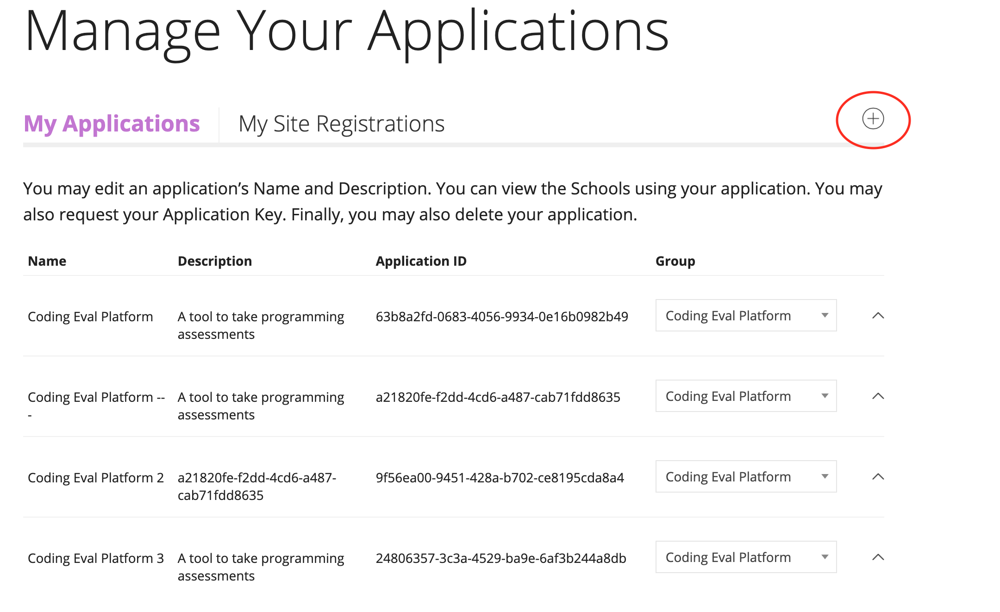
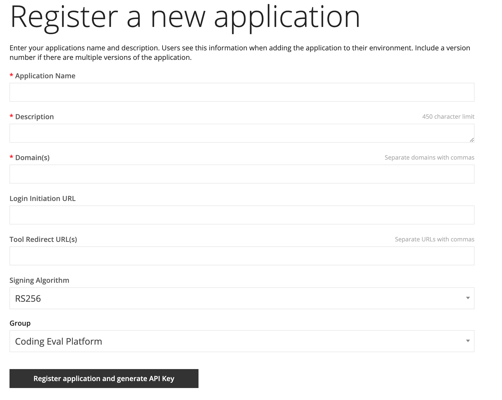
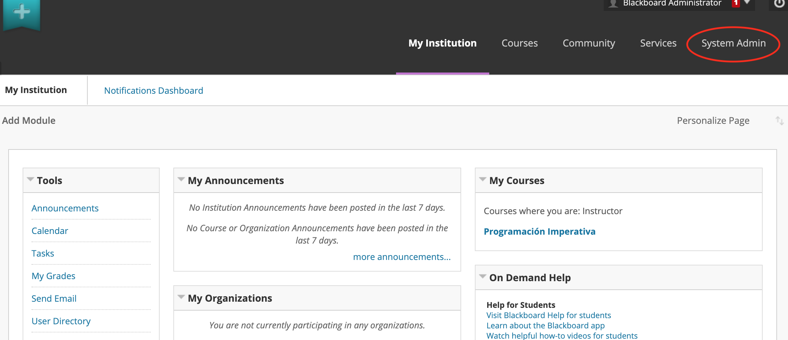
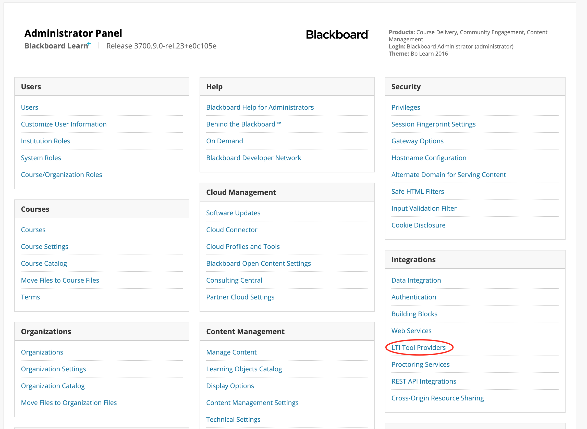
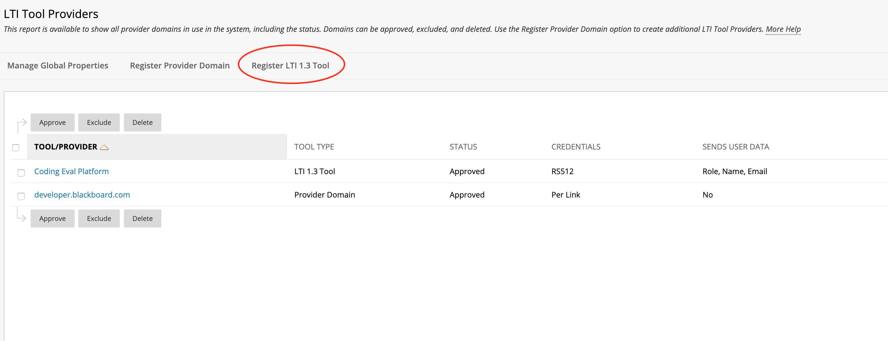
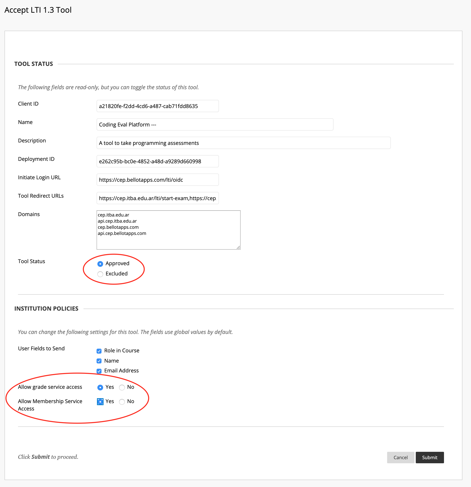
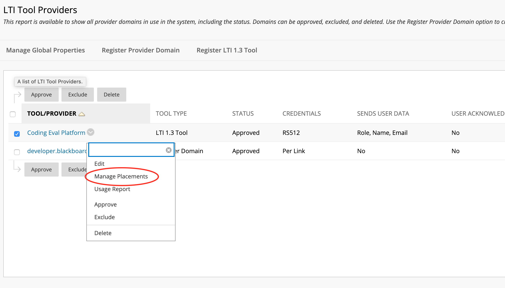
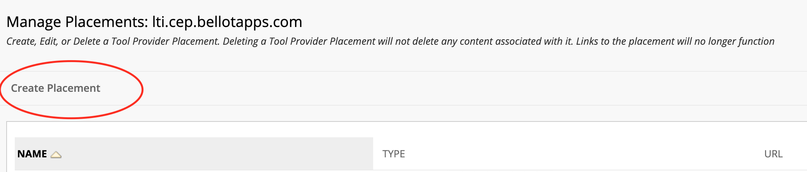

# Blackboard Learn

This document will guide you on how to integrate Coding Evaluation Platform with Blackboard Learn

## Tool registration in Blackboard's developer portal

1. Access Blackboard's developer portal: [https://developer.blackboard.com/](https://developer.blackboard.com/).

2. Create an account if you don't have one yet. Else just login.

3. Register a new application by pressing the "plus" sign

    

4. Fill in the required fields. Note that you will need a domain, and some urls (which must have the HTTPS scheme) to perform the integration.

    

    Note that you could create a new group by clicking the "My Groups" option in the navigation bar placed on the upper side of the window.
    
    - The Login Initiation URL must be something of the sort: `https://<domain>:<port>/init-login`
    - The Tool Redirect URLs must contain the followings: `https://<domain>:<port>/exam-selection` and `https://<domain>/exam-taking`

5. Once the "Register application and generate API Key" button is pressed, if everything is correct, the site will give you the necessary stuff to perform the integration. This includes

    - Application Key
    - Secret
    - Issuer
    - Public keyset URL
    - Auth token endpoint
    - Tool private key

    
    Make sure to store them safely.
    
6. After returning to the main view, the new registered application will be listed. Copy the Application ID. This value is also the Client ID.

## Tool registration in Blackboard Learn instance

1. Login to a Learn instance with an administrator user

2. Go to System Admin > LTI Tool Providers > Register LTI 1.3 Tool

    
    
    
    
    
    
    
3. Fill in the Client ID (this is the Application ID that was given to you by Blackboard's developers portal) and submit it. All the data will be displayed. 

4. Make sure that "Allow grade service access" and "Allow Membership Service Access" are set to "Yes", and that Tool Status is "Approved". Also make sure to copy the Deployment ID. Submit the form.

    
    
5. Once again in the LTI Tool Providers view you will see the new integration listed. Click in the dropdown menu, and select "Manage Placements", and then select "Create Placement"

    
    
    

6. Fill the required data. Make sure to select "Course content tool" in the type section, enabling the "Supports deep linking" option. Also make sure that the Tool Provider URL matches has the `/exam-selection` path (matching the Tool Redirect's URL). Submit the form

    .
